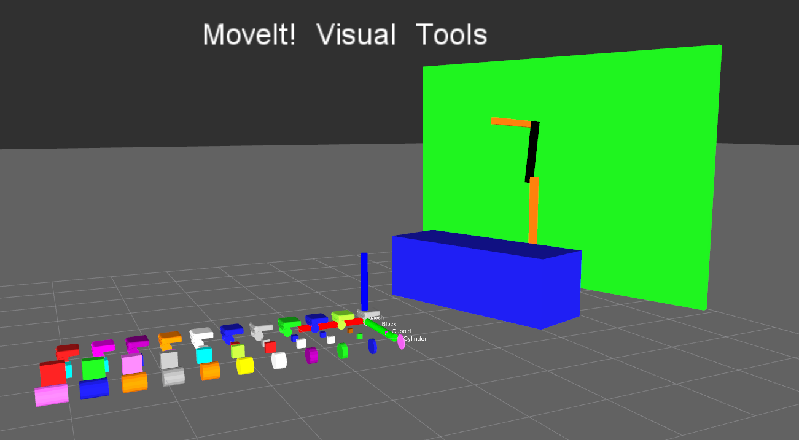
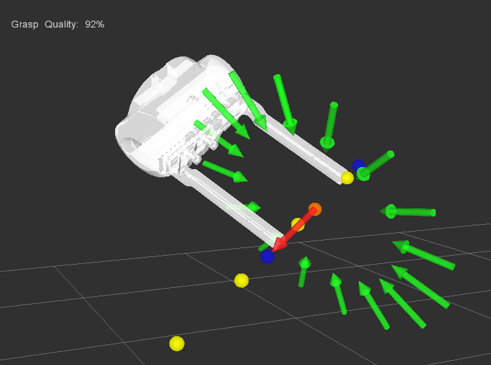

# MoveIt! Visual Tools

Helper functions for displaying and debugging MoveIt! data in Rviz via published markers, trajectories, and MoveIt! collision objects. It is sometimes hard to understand everything that is going on internally with MoveIt!, but using these quick convenience functions allows one to easily visualize their code. This package is built in top of [rviz_visual_tools](https://github.com/davetcoleman/rviz_visual_tools) and all those features are included via class inheritance.

This package helps you visualize:

 - Basic Rviz geometric shapes
 - MoveIt! collision objects
 - MoveIt! and ROS trajectories
 - Robot states
 - End effectors
 - Experimental: use interactive markers to move robot arm using IK

Developed by [Dave Coleman](http://dav.ee) at the Correll Robotics Lab, University of Colorado Boulder with outside contributors.

* [](https://travis-ci.org/davetcoleman/moveit_visual_tools) Travis CI

TODO: update these buttons for kinetic:
 * [](http://build.ros.org/view/Jsrc_uT/job/Jsrc_uT__moveit_visual_tools__ubuntu_trusty__source/) ROS Buildfarm - Trusty Devel Source Build
 * [](http://build.ros.org/view/Jbin_uT64/job/Jbin_uT64__moveit_visual_tools__ubuntu_trusty_amd64__binary/) ROS Buildfarm - AMD64 Trusty Debian Build






## Install

### Ubuntu Debian

    sudo apt-get install ros-kinetic-moveit-visual-tools

### Install From Source

Clone this repository into a catkin workspace, then use the rosdep install tool to automatically download its dependencies. Depending on your current version of ROS, use:

    rosdep install --from-paths src --ignore-src --rosdistro kinetic

## Quick Start Demo

First launch Rviz:

    roslaunch moveit_visual_tools demo_rviz.launch

Then run some demos displaying robot states and collision objects:

    roslaunch moveit_visual_tools demo.launch

## Code API

See [VisualTools Class Reference](http://docs.ros.org/kinetic/api/moveit_visual_tools/html/classmoveit__visual__tools_1_1MoveItVisualTools.html)

## Usage

We'll assume you will be using these helper functions within a class.

### Initialize

Add to your includes:
```
#include <moveit_visual_tools/moveit_visual_tools.h>
```

Add to your class's member variables:
```
// For visualizing things in rviz
moveit_visual_tools::MoveItVisualToolsPtr visual_tools_;
```

In your class' constructor add:
```
visual_tools_.reset(new moveit_visual_tools::MoveItVisualTools("base_frame","/moveit_visual_markers"));
```

### Collision Object Functions

Helpers for adding and removing objects from the MoveIt! planning scene. CO stands for Collision Object and ACO stands for Active Collision Object.

 - cleanupCO
 - cleanupACO
 - attachCO
 - publishCollisionBlock
 - publishCollisionCylinder
 - publishCollisionTree
 - publishCollisionTable
 - publishCollisionWall

And more...

### Animate Trajectories

Higher level robot and trajectory functions

 - publishTrajectoryPath
 - publishTrajectoryPoint
 - publishRobotState
 - publishAnimatedGrasps
 - publishIKSolutions

## Show parts of a robot

These functions are a little more complicated

 - publishEEMarkers

## Parent Class

This class is built on top of [rviz_visual_tools](https://github.com/davetcoleman/rviz_visual_tools) so all features and documentation for that package apply here as well.

## Developers Notes

Useful notes for anyone wanting to dig in deeper:

 -  All poses are published with respect to the world frame e.g. /world, /odom, or maybe /base
 -  All publish() ROS topics should be followed by a ``ros::spinOnce();`` but no sleep
 -  Do not want to load any features/publishers until they are actually needed since this library contains so many components

## Testing and Linting

To run [roslint](http://wiki.ros.org/roslint), use the following command with [catkin-tools](https://catkin-tools.readthedocs.org/):

    catkin build --no-status --no-deps --this --make-args roslint

To run [catkin lint](https://pypi.python.org/pypi/catkin_lint), use the following command with [catkin-tools](https://catkin-tools.readthedocs.org/):

    catkin lint -W2

Use the following command with [catkin-tools](https://catkin-tools.readthedocs.org/) to run the small amount of available tests:

    catkin run_tests --no-deps --this -i

## Contribute

Please send PRs for new helper functions, fixes, etc!
